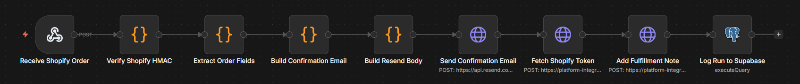
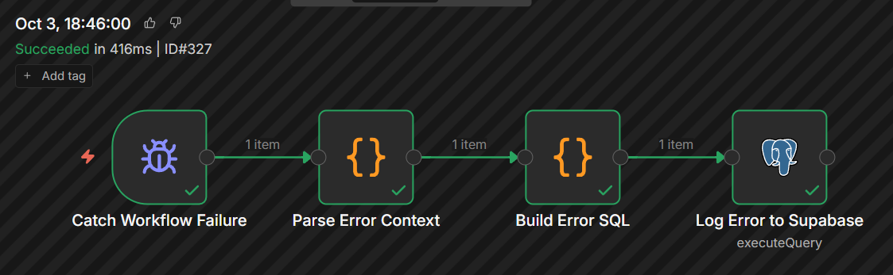
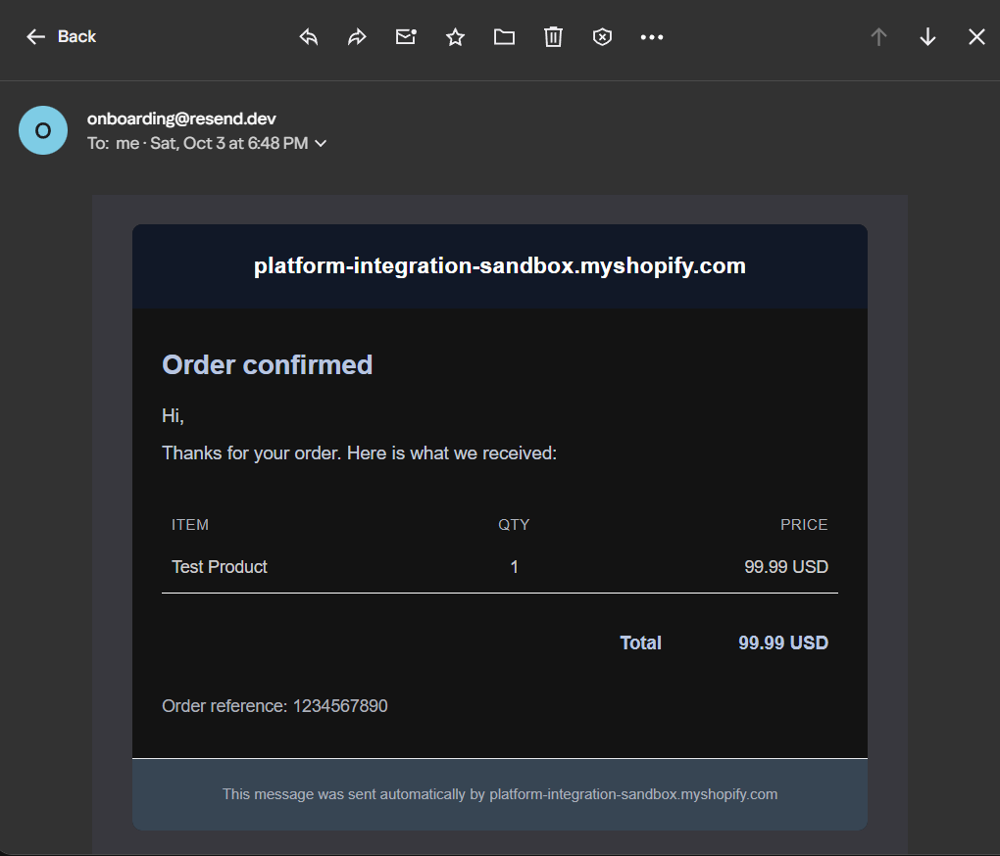
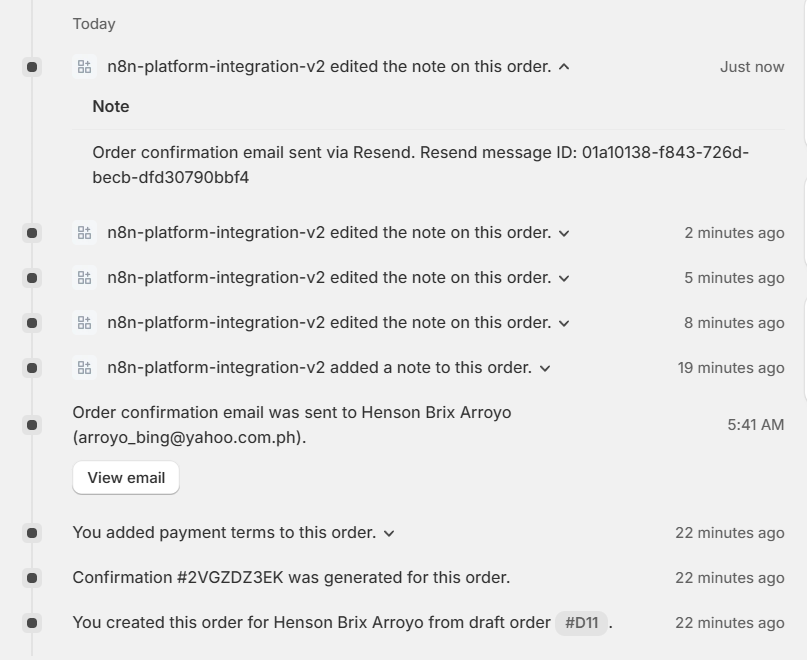
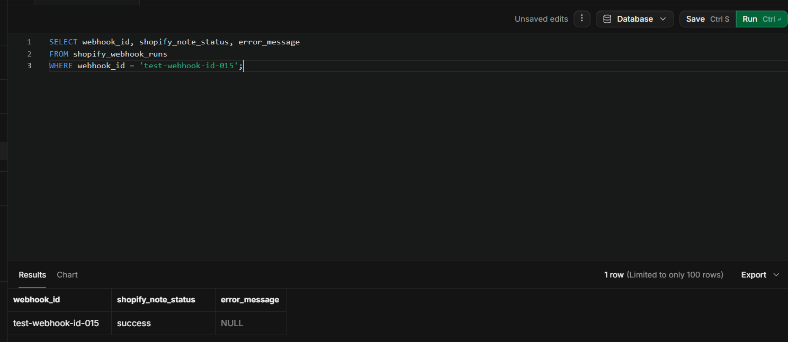
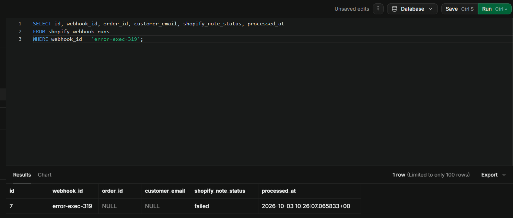

# Workflow 2: Shopify Order Confirmation Pipeline

[← Back to README](../../README.md)

**Status:** v1.0.0 published

## Problem

An online store receives an order. Shopify fires an `orders/create` webhook. The customer expects a confirmation email with what they ordered and how much they paid. The store owner expects a record on the order that the customer was notified. Nobody wants to do this manually.

This workflow automates the loop. It receives the webhook, verifies the signature, extracts the order fields, builds an HTML confirmation email, sends it via Resend, writes a note back to the Shopify order, and logs every run to Supabase for audit. A companion error-handler workflow catches failures and writes failure rows to the same audit table.

## Architecture

```
Receive Shopify Order (Webhook, raw body, headers)
→ Verify Shopify HMAC (Code, HMAC-SHA256 base64 comparison)
→ Extract Order Fields (Code, reshape payload)
→ Build Confirmation Email (Code, HTML + plain text)
→ Build Resend Body (Code, JSON.stringify)
→ Send Confirmation Email (HTTP Request, Resend API)
→ Fetch Shopify Token (HTTP Request, client credentials grant)
→ Add Fulfillment Note (HTTP Request, Shopify GraphQL)
→ Log Run to Supabase (Postgres, audit INSERT)

Catch Workflow Failure (Error Trigger, parallel)
→ Parse Error Context (Code, extract error fields)
→ Build Error SQL (Code, precompute INSERT)
→ Log Error to Supabase (Postgres, audit INSERT)
```

Nine nodes in the main workflow. Four nodes in the error handler. Two workflows total.

## Key implementation details

- **HMAC verification uses the Crypto node's limitation workaround.** n8n 2.8.4 blocks `require('crypto')` in Code nodes by default. The env var `NODE_FUNCTION_ALLOW_BUILTIN=crypto` must be set in the shell that starts n8n. The raw body is read from `getBinaryDataBuffer(0, 'data')`, not from a JSON field.
- **The token refresh is inside the workflow.** `Fetch Shopify Token` POSTs to the Shopify OAuth endpoint on every execution, retrieves a fresh 24-hour token, and passes it to `Add Fulfillment Note`. No manual credential refresh between runs.
- **Idempotency on the audit table.** The `webhook_id` column carries a unique index. The INSERT uses `ON CONFLICT (webhook_id) DO NOTHING`. Shopify retries do not create duplicate rows.
- **Errors use `ON CONFLICT DO UPDATE`.** If the happy path already wrote a row and a later node fails, the error handler overwrites the error fields. Both outcomes are captured.
- **HTML email is table-based with inline styles.** No `<style>` blocks. No external images. Gmail, Outlook, and Apple Mail all render it correctly. User content is HTML-escaped before insertion.

## Verified behavior

Happy path with test webhook ID `test-webhook-id-015`:

| Stage | Result |
|-------|--------|
| Webhook receives payload | 1 item, HMAC header present |
| HMAC verification | passes, order parsed |
| Extract Order Fields | customer_email, order_id, line_items populated |
| Build Confirmation Email | HTML renders with dark header, line items table, total |
| Send Confirmation Email | Resend returns email ID `01a10136-...` |
| Fetch Shopify Token | token prefix `shpca_`, scope write_customers,write_orders, expires in 86399s |
| Add Fulfillment Note | userErrors empty, order.note updated with Resend message ID |
| Log Run to Supabase | row inserted with shopify_note_status = 'success' |



Error path with test webhook ID `error-exec-326`:

| Stage | Result |
|-------|--------|
| Workflow fails at Add Fulfillment Note | execution 326 fails |
| Error Trigger fires | error handler workflow runs |
| Parse Error Context | extracts error_node, error_message, error class |
| Log Error to Supabase | row inserted with shopify_note_status = 'failed', error_message populated |



**Confirmation email.** Rendered in the customer's inbox with the order summary and total.



**Shopify order note.** The fulfillment note the workflow writes back to the order, referencing the Resend message ID.



**Supabase audit log, happy path.** The row written by a successful run.



**Supabase audit log, error path.** The row written when the error handler catches a failure.



Happy path with test webhook ID `test-webhook-id-015`:

| Stage | Result |
|-------|--------|
| Webhook receives payload | 1 item, HMAC header present |
| HMAC verification | passes, order parsed |
| Extract Order Fields | customer_email, order_id, line_items populated |
| Build Confirmation Email | HTML renders with dark header, line items table, total |
| Send Confirmation Email | Resend returns email ID `01a10136-...` |
| Fetch Shopify Token | token prefix `shpca_`, scope write_customers,write_orders, expires in 86399s |
| Add Fulfillment Note | userErrors empty, order.note updated with Resend message ID |
| Log Run to Supabase | row inserted with shopify_note_status = 'success' |

Error path with test webhook ID `error-exec-326`:

| Stage | Result |
|-------|--------|
| Workflow fails at Add Fulfillment Note | execution 326 fails |
| Error Trigger fires | error handler workflow runs |
| Parse Error Context | extracts error_node, error_message, error class |
| Log Error to Supabase | row inserted with shopify_note_status = 'failed', error_message populated |

Screenshots (see `docs/images/`):

- `02-canvas.png` — main workflow canvas, all nine nodes green
- `02-email.png` — HTML confirmation email as rendered in Yahoo Mail
- `02-shopify-note.png` — Shopify order detail showing the note added by the app
- `02-supabase-success.png` — happy path row in `shopify_webhook_runs`
- `02-supabase-error.png` — error path row in `shopify_webhook_runs`
- `02-error-handler-canvas.png` — error handler workflow canvas

## Stack

n8n 2.8.4 (self-hosted) · Shopify Admin API (2026-10, GraphQL) · Resend API · Supabase (PostgreSQL) · Cloudflare Quick Tunnel

## Gotchas

- **n8n 2.8.4 blocks `require('crypto')` in Code nodes by default.** The env var `NODE_FUNCTION_ALLOW_BUILTIN=crypto` must be set in the shell that starts n8n. Without it, the HMAC verification node fails with `Module 'crypto' is disallowed`. Set it in the same PowerShell window as `n8n start`, or export it in the shell profile.
- **The Webhook node's raw body is stored as binary, not as a JSON field.** Access it with `await this.helpers.getBinaryDataBuffer(0, 'data')` inside a Code node. The field name `data` is the default for the Webhook node's binary payload. `$json.rawBody` and `$json.bodyRaw` do not exist.
- **Resend free tier restricts recipients to the account owner's email address.** The workflow sends to `customer_email` from the Shopify order. On Resend's free tier, any recipient other than the address registered on the Resend account is rejected with `403: You can only send testing emails to your own email address`. For portfolio testing, use the account owner's email as the recipient. For production use, verify a domain at `resend.com/domains` and change the `from` field in `Build Resend Body` to an address on that domain.
- **n8n caches node output between test executions.** When debugging, always re-execute the full chain from the Webhook node via **Listen for test event**. Do not click **Execute step** on individual nodes. A downstream node will replay the cached input from the previous execution and produce misleading results.
- **The leading `=` leaks into HTTP Request node JSON body and header fields.** In n8n 2.8.4, if a JSON body or header value field is in Expression mode (fx toggle on), the content must be `{{ expression }}` without the leading `=`. The `=` is required only in Fixed mode. Getting this wrong sends a body starting with `=`, which every JSON-strict API rejects.
- **The Error Trigger payload does not include upstream node output.** n8n 2.8.4 sends a flat error summary: `parameter`, `functionality`, `name`, `message`, `stack`, `lastNodeExecuted`, `mode`, `executionContext`, `workflow`. There is no `data.resultData.runData` field. The `Parse Error Context` node cannot reconstruct the original webhook ID from the error payload. Error rows use a fallback key `error-exec-<execution-id>` and leave `order_id` and `customer_email` NULL. The execution URL in `error_message` is the traceability path.
- **The n8n Error Trigger does not fire for manual test executions.** It only fires for automatic, production executions. To test the error path, publish the main workflow and send to the Production URL, not the Test URL.
- **Supabase free tier RLS must be disabled on the audit table.** If RLS is enabled and no insert policy exists for the service role, the Postgres INSERT fails silently. Either disable RLS on `shopify_webhook_runs` or add an insert policy. This is a portfolio tradeoff documented in the roadmap.
- **Shopify Admin API tokens expire in 24 hours.** The `Fetch Shopify Token` node refreshes the token on every execution. For high-volume stores, cache the token in Supabase with a 23-hour TTL to avoid one extra HTTP request per webhook.
- **SQL injection warning from n8n's Postgres node is acknowledged.** The workflow uses string interpolation with `.replace(/'/g, "''")` for escaping. All values are either workflow-generated or HMAC-verified, so injection is not a realistic threat. Parameterized queries are a roadmap item.

## Setup prerequisites

Before importing the workflows, prepare:

1. **Shopify Partner account and development store.** App created in the Dev Dashboard with scopes `read_orders`, `write_orders`, `read_customers`, `write_customers`. App installed on the store. Client ID and client secret saved to a scratch file.
2. **Resend account.** Free tier. API key saved to a scratch file. Sender is `onboarding@resend.dev`. Recipient for testing must be the Resend account owner's email.
3. **Supabase project.** Free tier. Table `shopify_webhook_runs` created with the schema below. Connection credentials saved to n8n as a Postgres credential named `Supabase Postgres (v2)`.
4. **n8n environment variable.** `NODE_FUNCTION_ALLOW_BUILTIN=crypto` set in the shell that starts n8n.
5. **Cloudflare Quick Tunnel.** Running with a public HTTPS URL. `WEBHOOK_URL` env var set to the tunnel URL before `n8n start`.
6. **Shopify Admin API credential.** A Header Auth credential named `Shopify Admin API` with header name `X-Shopify-Access-Token`. The value is left blank; the workflow fetches its own token.
7. **Resend credential.** A Header Auth credential named `Resend API` with header name `Authorization` and value `Bearer re_...`.

## Supabase schema

```sql
CREATE TABLE shopify_webhook_runs (
  id BIGSERIAL PRIMARY KEY,
  webhook_id TEXT NOT NULL,
  topic TEXT,
  order_id TEXT,
  order_number TEXT,
  customer_email TEXT,
  total_price NUMERIC(12, 2),
  currency VARCHAR(3),
  financial_status TEXT,
  resend_message_id TEXT,
  shopify_note_status TEXT,
  shop_domain TEXT,
  order_raw JSONB,
  webhook_headers JSONB,
  processed_at TIMESTAMPTZ NOT NULL DEFAULT NOW(),
  error_message TEXT
);

CREATE UNIQUE INDEX idx_shopify_webhook_runs_webhook_id
  ON shopify_webhook_runs (webhook_id);

CREATE INDEX idx_shopify_webhook_runs_processed_at
  ON shopify_webhook_runs (processed_at DESC);

CREATE INDEX idx_shopify_webhook_runs_order_id
  ON shopify_webhook_runs (order_id);

ALTER TABLE shopify_webhook_runs DISABLE ROW LEVEL SECURITY;
```

## Testing checklist

**Happy path test.** Send a test payload to the production webhook URL with a valid HMAC:

```powershell
$creds = Get-Content "D:\secret\platform-integration-portfolio-shopify-credentials.txt" | Where-Object { $_ -match "=" }
foreach ($line in $creds) {
  $k, $v = $line -split "=", 2
  Set-Variable -Name $k.Trim() -Value $v.Trim()
}
$clientSecret = $SHOPIFY_CLIENT_SECRET

$body = Get-Content -Raw "$env:TEMP\shopify-test-order.json"
$hmac = [System.Security.Cryptography.HMACSHA256]::new([System.Text.Encoding]::UTF8.GetBytes($clientSecret))
$signatureBytes = $hmac.ComputeHash([System.Text.Encoding]::UTF8.GetBytes($body))
$signature = [System.Convert]::ToBase64String($signatureBytes)
$env:SHOPIFY_TEST_HMAC = $signature

curl.exe -X POST "https://YOUR_PUBLIC_URL/webhook/shopify-order-intake" `
  -H "Content-Type: application/json" `
  -H "X-Shopify-Hmac-Sha256: $env:SHOPIFY_TEST_HMAC" `
  -H "X-Shopify-Topic: orders/create" `
  -H "X-Shopify-Webhook-Id: test-webhook-id-001" `
  --data-binary "@$env:TEMP\shopify-test-order.json"
```

Verify the happy path row:

```sql
SELECT webhook_id, shopify_note_status, error_message, processed_at
FROM shopify_webhook_runs
WHERE webhook_id = 'test-webhook-id-001';
```

**Idempotency test.** Re-send the same payload with the same webhook ID. Then:

```sql
SELECT count(*) FROM shopify_webhook_runs WHERE webhook_id = 'test-webhook-id-001';
```

Expected: 1. The unique constraint and `ON CONFLICT DO NOTHING` prevent duplicate rows.

**Error path test.** Temporarily break a node, publish the workflow, send to the production URL with a new webhook ID. Then:

```sql
SELECT webhook_id, shopify_note_status, error_message
FROM shopify_webhook_runs
WHERE webhook_id LIKE 'error-%'
ORDER BY processed_at DESC
LIMIT 3;
```

Expected: a row with `shopify_note_status = 'failed'` and a populated `error_message`.

## Roadmap

- Migrate the Supabase INSERT from string interpolation to parameterized queries. Blocked by an n8n Postgres node bug where comma-containing values break the query parameter parser.
- Verify a custom domain with Resend to enable sending confirmation emails to real customer addresses.
- Cache the Shopify token in Supabase with a 23-hour TTL for high-volume stores.
- Replace the Cloudflare Quick Tunnel with a named tunnel for a stable webhook URL. Eliminates the manual re-registration of the Shopify webhook on every cloudflared restart.

## Monitored by

Not yet monitored. See the sibling repo's Workflow Health Monitor.