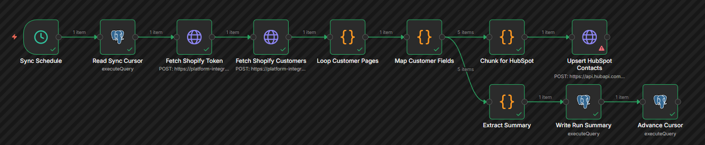
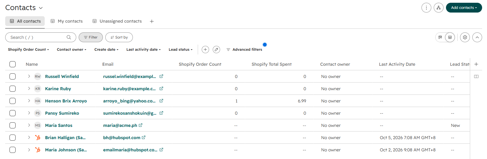
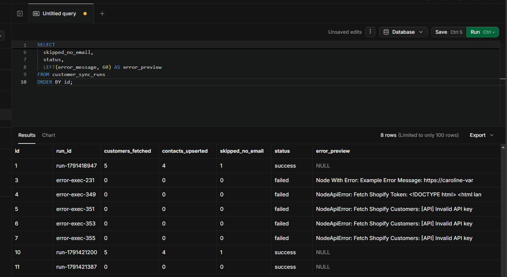
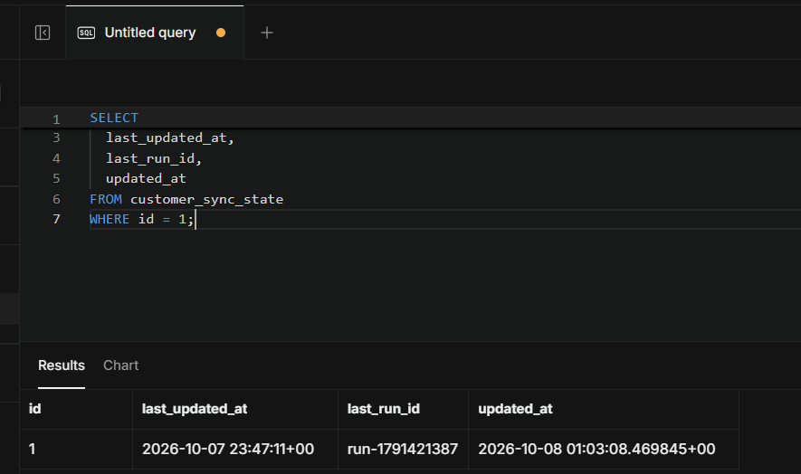
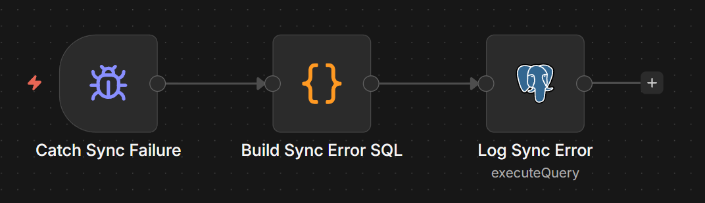
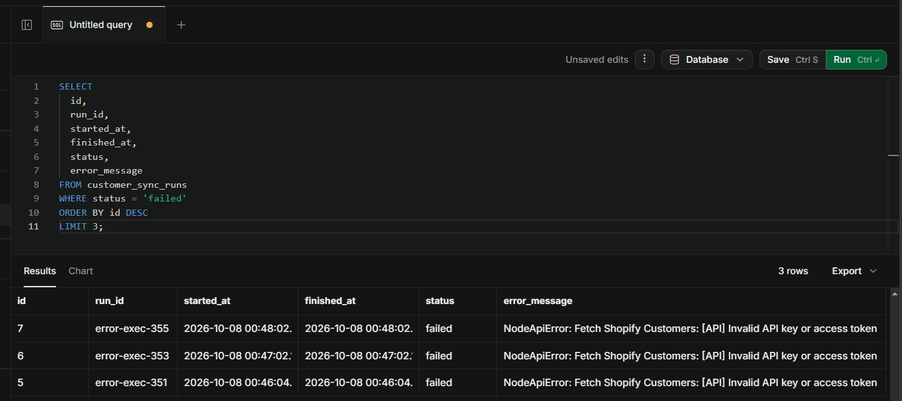

# Workflow 3: Shopify to HubSpot Customer Sync

[← Back to README](../../README.md)

**Status:** v1.0.0 published

## Problem

A store owner runs Shopify. They use HubSpot as their CRM. Every new customer who creates an account on Shopify should appear in HubSpot as a contact with the customer's first name, last name, email, and two CRM fields: order count and lifetime spend. Keeping those fields up to date by hand does not scale. Exporting and importing CSVs is error-prone and never current.

This workflow syncs customers from Shopify to HubSpot on a schedule. It uses a cursor-based incremental fetch so each run only processes customers updated since the last successful sync. The cursor advances only after the full pipeline succeeds. Failed runs are logged with their error context and do not advance the cursor.

## Architecture

```
Sync Schedule (cron, hourly)
  → Read Sync Cursor (Postgres, read high-water mark)
    → Fetch Shopify Token (HTTP, client credentials grant)
      → Fetch Shopify Customers (GraphQL, page 1)
        → Loop Customer Pages (Code, paginate + break on cursor)
          → Map Customer Fields (Code, reshape + skip no-email)
            ├──► Chunk for HubSpot (Code, batch up to 100)
            │      → Upsert HubSpot Contacts (HTTP, batch/upsert)
            └──► Extract Summary (Code, keep summary item)
                   → Write Run Summary (Postgres, INSERT)
                     → Advance Cursor (Postgres, UPDATE)

Catch Sync Failure (Error Trigger, parallel)
  → Build Sync Error SQL (Code)
    → Log Sync Error (Postgres, INSERT)
```

Eleven nodes in the main workflow. Three in the error handler. Two workflows total.



## Key implementation details

- **Cursor semantics.** The cursor is a `TIMESTAMPTZ` stored in `customer_sync_state.last_updated_at`. It represents the newest customer `updatedAt` from the last successful run. Only customers with `updatedAt > cursor` are processed.
- **GraphQL pagination with break-on-cursor.** Shopify's GraphQL Admin API does not support a server-side `updatedAt` filter on the `customers` field. The workflow sorts by `UPDATED_AT` descending and breaks out of pagination as soon as it hits a customer whose `updatedAt` is `<=` the cursor. The `Loop Customer Pages` Code node handles the entire pagination chain in a single `await this.helpers.httpRequest` loop.
- **HubSpot batch upsert keyed on email.** `POST /crm/v3/objects/contacts/batch/upsert` with `idProperty: "email"`. Creates new contacts, updates existing contacts by email match. Idempotent on re-runs.
- **Custom properties as strings.** HubSpot's batch upsert requires all property values as strings. `shopify_order_count` and `shopify_total_spent` are Number-type properties in HubSpot but are sent as string values (`"2"`, `"13.98"`).
- **Skip no-email customers.** Customers with `email: null` are filtered out in `Map Customer Fields`. They are counted in `skipped_no_email` on the summary item. They never reach HubSpot.
- **Cursor advance is the last step.** `Advance Cursor` runs only after `Write Run Summary` succeeds. If any earlier node fails, the workflow aborts, the error handler writes a failure row, and the cursor stays put.
- **Failed rows leave count columns NULL.** The workflow does not know how many customers a failed run would have fetched. Zero would be a false claim. `status = 'failed'` and `error_message` are the audit signal.

## Verified behavior

Real sync (execution `run-1791421200`):

| Stage | Result |
|-------|--------|
| Sync Schedule | fires |
| Read Sync Cursor | returns seed value `1970-01-01T00:00:00Z` |
| Fetch Shopify Token | token prefix `shpca_`, scope `write_customers,write_orders`, expires 86399s |
| Fetch Shopify Customers | page 1 returns 2 customers, `hasNextPage: true` |
| Loop Customer Pages | `total_fetched: 5`, `pages_fetched: 3`, all 5 customers accumulated |
| Map Customer Fields | 4 customer items + 1 summary item; `skipped_no_email: 1` |
| Chunk for HubSpot | 1 chunk with 4 inputs |
| Upsert HubSpot Contacts | HubSpot returns 4 results; contacts created/updated |
| Extract Summary | summary item with `chunks_created: 1`, `highest_updated_at: 2026-10-07T23:47:11Z` |
| Write Run Summary | row with `customers_fetched: 5`, `contacts_upserted: 4`, `status: 'success'` |
| Advance Cursor | `last_updated_at` set to `2026-10-07T23:47:11Z` |







No-op run (execution `run-1791421387`, after cursor was current):

| Stage | Result |
|-------|--------|
| Fetch Shopify Customers | page 1 returns newest customer; `updatedAt` equals cursor |
| Loop Customer Pages | break on first customer; `total_fetched: 0` |
| Map Customer Fields | 0 customer items + 1 summary item |
| Chunk for HubSpot | 0 chunks |
| Upsert HubSpot Contacts | skipped (no input) |
| Extract Summary | summary item with `chunks_created: 0` |
| Write Run Summary | row with `customers_fetched: 0`, `status: 'success'` |
| Advance Cursor | `last_updated_at` written back to itself; `updated_at` timestamp advances |

Failed run via scheduled execution (execution `error-exec-353`):

| Stage | Result |
|-------|--------|
| Fetch Shopify Token | fails with invalid URL |
| Error handler fires | Shopify Customer Sync Error Handler runs |
| Build Sync Error SQL | extracts `NodeApiError: Fetch Shopify Token: <message>` |
| Log Sync Error | row with `status: 'failed'`, `error_message` populated |
| Cursor | `last_updated_at` unchanged from last successful run |





## Stack

n8n 2.8.4 (self-hosted) · Shopify GraphQL Admin API 2026-10 · HubSpot CRM API v3 · Supabase (PostgreSQL) · Cloudflare Quick Tunnel

## Gotchas

- **The Shopify GraphQL Admin API does not support a server-side `updatedAt` filter on customers.** The workflow fetches customers sorted by `UPDATED_AT` descending and breaks out of pagination when a customer older than the cursor appears. This is a workaround until Shopify adds the filter. On large stores (10,000+ customers), the fetch can be expensive because it paginates through every customer updated after the cursor plus one page. No better option exists today.
- **Shopify's `Customer.numberOfOrders` and `Customer.amountSpent` are computed aggregates.** They update asynchronously after an order is created or modified. Delays range from minutes to several hours. The sync sends whatever Shopify returns at fetch time; a subsequent run picks up the propagated value.
- **`Customer.amountSpent` does not deduct refunds.** A customer who spent $5,000 and refunded $4,500 shows $5,000. It also excludes cancelled and voided orders. Documented Shopify behavior. The workflow does not attempt to reconcile.
- **HubSpot's batch upsert requires all property values as strings.** Number-type custom properties receive numeric strings (`"2"`, `"13.98"`). Passing JavaScript numbers causes a type validation error.
- **`first: 2` page size is a demo constraint, not a production value.** Production would use `first: 100` or higher to reduce pagination calls. The 2-customer page size exists so a 5-customer dev store demonstrates multiple pages.
- **Postgres read-committed isolation can return a stale cursor value if a workflow trigger fires while the cursor UPDATE is still in flight.** This appeared during debugging when an UPDATE was run in the Supabase SQL Editor and the workflow was triggered immediately afterward. The mitigation is to run a SELECT after the UPDATE and wait for the new value to be visible before triggering the workflow. Scheduled runs are not affected.
- **Zero-customer runs are legitimate when the cursor is current.** If a run reports `customers_fetched: 0` and you expect new customers, check the cursor value in `customer_sync_state`. A stale cursor combined with the `<=` break condition causes the loop to skip all customers while still reporting success. Silent failure mode.
- **`Advance Cursor` reads from `Extract Summary`, not from `Upsert HubSpot Contacts`.** On no-op runs, `Upsert HubSpot Contacts` produces zero items and its downstream branch halts. `Advance Cursor` must live on the summary branch, which always produces one item. If it were wired after the upsert node, the no-op path would break the chain.
- **n8n 2.8.4's Error Trigger does not fire on manual executions.** Only automatic executions (scheduled, webhook-triggered) reach the linked error workflow. Testing the error path requires publishing the workflow and waiting for the schedule to fire, or triggering via webhook.
- **n8n 2.8.4 requires an explicit Save click in the Workflow Settings modal.** The Error Workflow dropdown does not persist on modal close. Click Save, then save the workflow itself (`Ctrl+S`). There is a known bug where saving workflow settings does not activate the main toolbar's Save button; make a small canvas change to dirty the workflow, then save.

## Setup prerequisites

1. **Shopify Partner account and development store.** App with scopes `read_customers`, `write_customers`, `read_orders`, `write_orders`. Custom Distribution. App installed on the store. Client ID and client secret in `D:\secret\platform-integration-portfolio-shopify-credentials.txt`.
2. **HubSpot developer account.** Private app with `crm.objects.contacts.write` scope. Token in n8n as a Header Auth credential named `HubSpot App Token account`. Two custom contact properties created via the UI: `shopify_order_count` (Number) and `shopify_total_spent` (Number).
3. **Supabase project.** Tables `customer_sync_state` and `customer_sync_runs` created. Postgres credential in n8n named `Supabase Postgres (v2)`.
4. **n8n environment.** `NODE_FUNCTION_ALLOW_BUILTIN=crypto` set in the shell that starts n8n.
5. **Cloudflare Quick Tunnel.** Running with a public HTTPS URL. `WEBHOOK_URL` set before `n8n start`. Not strictly required for this workflow since the trigger is scheduled, but the same tunnel supports the other workflows in this repo.

## Supabase schema

```sql
CREATE TABLE customer_sync_state (
  id INTEGER PRIMARY KEY DEFAULT 1 CHECK (id = 1),
  last_updated_at TIMESTAMPTZ NOT NULL DEFAULT '1970-01-01T00:00:00Z',
  last_run_id TEXT,
  updated_at TIMESTAMPTZ NOT NULL DEFAULT NOW()
);

INSERT INTO customer_sync_state (id, last_updated_at)
VALUES (1, '1970-01-01T00:00:00Z')
ON CONFLICT (id) DO NOTHING;

CREATE TABLE customer_sync_runs (
  id BIGSERIAL PRIMARY KEY,
  run_id TEXT NOT NULL,
  started_at TIMESTAMPTZ NOT NULL DEFAULT NOW(),
  finished_at TIMESTAMPTZ,
  cursor_before TIMESTAMPTZ,
  cursor_after TIMESTAMPTZ,
  customers_fetched INTEGER DEFAULT 0,
  contacts_upserted INTEGER DEFAULT 0,
  skipped_no_email INTEGER DEFAULT 0,
  status TEXT NOT NULL CHECK (status IN ('running', 'success', 'failed')),
  error_message TEXT
);

CREATE UNIQUE INDEX idx_customer_sync_runs_run_id
  ON customer_sync_runs (run_id);

CREATE INDEX idx_customer_sync_runs_started_at
  ON customer_sync_runs (started_at DESC);
```

## Testing checklist

**Happy path test.**

1. Reset the cursor:

```sql
UPDATE customer_sync_state SET last_updated_at = '1970-01-01T00:00:00Z' WHERE id = 1;
```

2. Confirm the update committed:

```sql
SELECT last_updated_at FROM customer_sync_state WHERE id = 1;
```

Wait for the SELECT to show `1970-01-01` before proceeding.

3. In n8n, click `Sync Schedule` → **Execute workflow**.
4. Verify:

```sql
SELECT run_id, customers_fetched, contacts_upserted, skipped_no_email, status
FROM customer_sync_runs
ORDER BY id DESC
LIMIT 1;
```

Expected: `customers_fetched: 5`, `contacts_upserted: 4`, `skipped_no_email: 1`, `status: 'success'`.

**Idempotency test.**

Run the workflow again immediately. The cursor now equals the newest customer's `updatedAt`. The loop breaks on the first customer. Expected: a new row with `customers_fetched: 0`. `Upsert HubSpot Contacts` is skipped. `Advance Cursor` writes the same value back.

**Error path test.**

1. Change `Fetch Shopify Token` URL to an invalid endpoint
2. Change `Sync Schedule` cron to `* * * * *` (every minute)
3. Unpublish, then Publish the main workflow
4. Wait up to 60 seconds for a scheduled run
5. Confirm the error handler fires and a `status: 'failed'` row appears in `customer_sync_runs`
6. Restore the URL and cron
7. Unpublish, then Publish

## Roadmap

- Migrate the Supabase INSERTs from string interpolation to parameterized queries. Same limitation as Workflow 2: the n8n Postgres node breaks on comma-containing values in query parameters.
- Add a `customers_fetched` count on failed rows when the failure happens after `Loop Customer Pages`. Requires reading run data from the error payload, which n8n does not consistently provide.
- Add a `customers_updated` counter that tracks only customers whose fields actually changed, not all fetched customers. Requires diffing against HubSpot's current values, which adds an extra API call per customer.
- Support two-way sync. Shopify to HubSpot only for now.

## Monitored by

Not yet monitored. See the sibling repo's [Workflow Health Monitor](https://github.com/Xhenzouu/n8n-automation-portfolio/blob/main/docs/workflows/10-workflow-health-monitor.md).