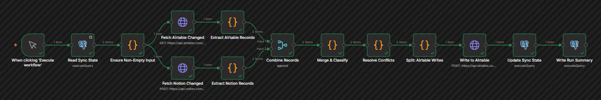
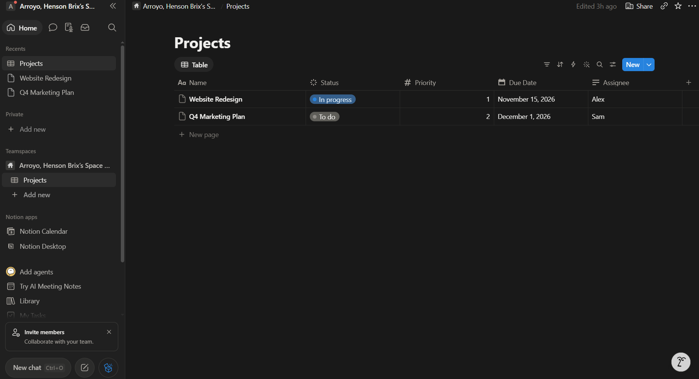
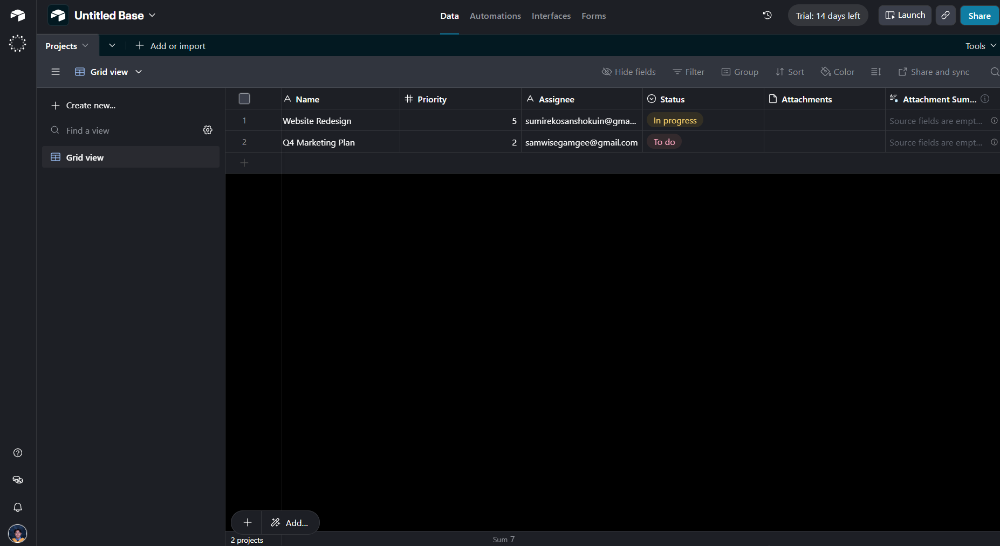
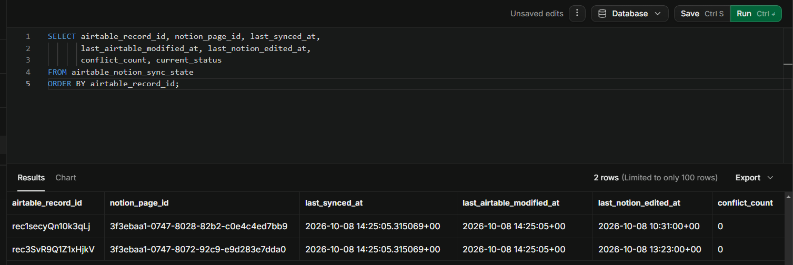
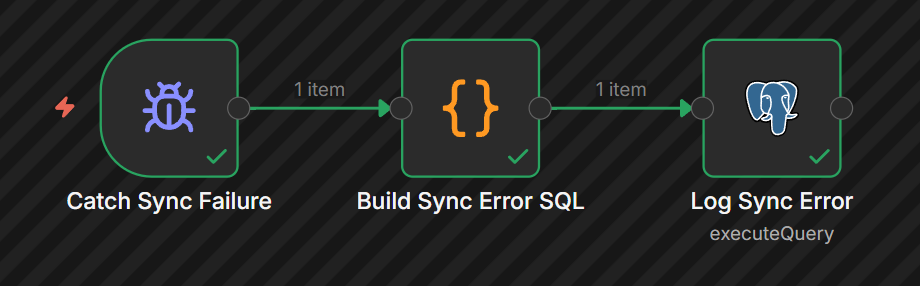
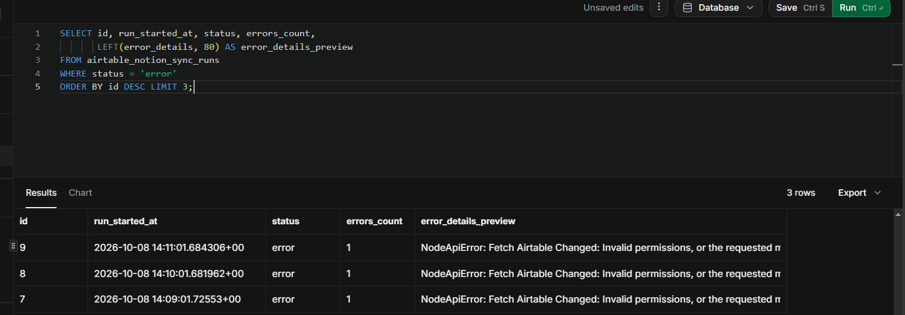

# Workflow 4: Airtable ↔ Notion Two-Way Sync

[← Back to README](../../README.md)

**Status:** Notion → Airtable verified end to end. Airtable → Notion write path deferred (see [Roadmap](#roadmap)).

## Problem

A small team tracks projects in Airtable and documents them in Notion. Records exist in both tools but drift because each side is edited independently. When two people edit the same record on different platforms, the team has no way to know which version is authoritative, and no audit trail of what changed when.

This workflow keeps records in sync on a schedule, detects when both sides have changed since the last run, and surfaces conflicts for review rather than silently overwriting one side.

## Architecture

```
Schedule Trigger (every 2 hours)
→ Read Sync State (Supabase Postgres)
→ Ensure Non-Empty Input (Code)
    ├── Fetch Airtable Changed (HTTP) → Extract Airtable Records (Code) ─┐
    └── Fetch Notion Changed (HTTP)   → Extract Notion Records (Code)   ─┴→ Combine Records (Merge, Append)
→ Merge & Classify (Code)
→ Resolve Conflicts (Code)
→ Split: Airtable Writes (Code)
→ Write to Airtable (HTTP)
→ Update Sync State (Postgres)
→ Write Run Summary (Postgres)
```

Error handling lives in a separate workflow, linked via **Settings → Error Workflow**.



## Key implementation details

### Envelope unwrapping and item combining

n8n's HTTP Request node wraps responses in a platform-specific envelope:

- **Airtable:** `[{ records: [...] }]` (array-wrapped when pagination is enabled)
- **Notion:** `[{ object: "list", results: [...] }]` (same)

When two fetch nodes feed a single Code node, `$input.all()` does **not** reliably concatenate items from both branches. In testing, `Merge & Classify` consistently received items from only one branch.

To make the merge deterministic:

1. Each fetch is followed by a dedicated Code node (`Extract Airtable Records`, `Extract Notion Records`) that unwraps the envelope and tags each item with `_source: "airtable"` or `_source: "notion"`.
2. A Merge node (mode: **Append**, 2 inputs) concatenates the two flat streams.
3. `Merge & Classify` receives only flat, tagged records.

**Design deviation from the original plan.** The original design fed both fetches directly into `Merge & Classify`. The three-node extract-combine pattern was introduced after observing silent item-dropping during testing. The current design supersedes the original.

### Per-record sync state

The Supabase table `airtable_notion_sync_state` tracks one row per synced record pair:

| Column | Purpose |
|--------|---------|
| `airtable_record_id` | Airtable record identifier |
| `notion_page_id` | Notion page identifier |
| `last_synced_at` | When this pair was last processed |
| `last_airtable_modified_at` | Airtable `Last Modified` at last sync |
| `last_notion_edited_at` | Notion `last_edited_time` at last sync |
| `conflict_count` | Lifetime count of conflict detections |
| `current_status` | `active`, `conflict_flagged`, `orphaned_source`, `orphaned_target` |

Change detection compares the fetched timestamps against the stored values with a 2-second tolerance to absorb clock skew between platforms.

### Change detection

- **Airtable:** requires a manual `Last modified time` field. `filterByFormula` restricts the fetch to records where `Last Modified > (now - 5 minutes)`.
- **Notion:** native `last_edited_time` on each page. The `/v1/data_sources/{id}/query` endpoint returns it.

### Conflict detection and resolution

`Merge & Classify` emits three operation types:

- `create`: one side has a record the other doesn't
- `update`: only one side changed since last sync
- `conflict`: both sides changed since last sync

`Resolve Conflicts` is currently a pass-through that drops `conflict` operations. Policy application (`newest_wins`, `source_wins`, `target_wins`, `flag_for_review`) is a Roadmap item.

### Idempotency

The `Update Sync State` node uses `INSERT ... ON CONFLICT (notion_page_id) DO UPDATE`, keyed on the Notion page ID. This ensures:

- Re-running the workflow without changes produces `_noop` and no writes.
- A retry after a network timeout does not create duplicate sync state rows.
- The Airtable record ID is updated in place when the paired record changes.

## Verified behavior

Verified end to end for the **Notion → Airtable** direction:

- A Notion page edit produces an Airtable record write.
- The sync state row's `last_notion_edited_at` is updated to the new timestamp.
- The run summary row records `status = 'success'`.
- A repeat run with no changes produces `_noop` and no writes (idempotent).







Verified for the error path:

- The error handler workflow fires on scheduled execution failures.
- Error rows are written to `airtable_notion_sync_runs` with `status = 'error'`, `errors_count = 1`, and `error_details` populated from the Error Trigger payload.





**Not yet verified:** the Airtable → Notion direction has no `Write to Notion` node. `Merge & Classify` produces operations targeting Notion, but no node consumes them. This is documented as a Roadmap item.

## Stack

n8n 2.8.4 (self-hosted, Windows) · Airtable free tier (PAT auth, Header Auth credential) · Notion free tier (Internal Integration token, Custom Auth credential with `Authorization` and `Notion-Version: 2026-03-11`) · Supabase free tier (Postgres 15)

Cloudflare Quick Tunnel is not required. This is a scheduled workflow with no inbound webhook.

## Gotchas

### n8n 2.8.4

- **Code node cache.** Pasted code updates do not always take effect without deleting and recreating the node. Affected `Merge & Classify` multiple times during the build.
- **`$input.all()` from multiple branches.** Does not reliably concatenate. Use a Merge node with mode: Append.
- **Postgres `$1` parameters.** The Postgres node's `Execute Query` operation does not accept positional parameters unless configured under Options → Query Parameters. String interpolation with `{{ }}` expressions is the simpler path for dynamic values.
- **Empty Code node output.** `return []` in Run Once for All Items mode can trigger "Code doesn't return items properly." Returning `[{ json: { _noop: true } }]` avoids the validator.
- **`console.log` from Code nodes.** Writes to the browser console, not the n8n server terminal. Open Developer Tools (F12) to see the output.

### Airtable

- **`Last modified time` field is required.** Airtable's API does not expose a modification timestamp by default. The field must be added manually in the UI.
- **Envelope shape varies.** With pagination enabled, the response is `[{ records: [...] }]`. Without, it's `{ records: [...] }`. The extract node handles both.
- **PAT scoping.** A Personal Access Token cannot be scoped to "all bases." Each base must be added explicitly.

### Notion

- **Data source vs. database endpoints.** The current API version uses `/v1/data_sources/{id}/query` for queries. The older `/v1/databases/{id}/query` is deprecated.
- **`Notion-Version` header is required** on every request. Missing it produces a confusing 400.
- **Status property options must pre-exist.** A Notion `status` value must be configured in the database schema before the API will accept it.
- **`last_edited_time` is a page-level field**, not a property. It's a sibling of `properties` in the API response.

## Setup prerequisites

1. **Airtable base** with a table named `Projects` (or update the URL). Fields: `Name` (text), `Status` (single select), `Priority` (number), `Due Date` (date), `Assignee` (text), `Last Modified` (last modified time).
2. **Airtable PAT** with scopes `data.records:read`, `data.records:write`, `schema.bases:read`. Scoped to the target base.
3. **n8n credential:** Header Auth named `Airtable PAT` with header `Authorization: Bearer pat...`.
4. **Notion database** with a data source. Properties: `Name` (title), `Status` (status, options `To do`, `In progress`, `Done`), `Priority` (number), `Due Date` (date), `Assignee` (rich text).
5. **Notion internal connection** with a `ntn_...` token. Capabilities: Read, Insert, Update. The database's parent data source ID is required for the fetch URL.
6. **n8n credential:** Custom Auth named `Notion Internal` with headers `Authorization: Bearer ntn_...` and `Notion-Version: 2026-03-11`.
7. **Supabase project** with the schema below. Credential `Supabase Postgres v2`.

## Supabase schema

```sql
-- Per-record sync state
CREATE TABLE IF NOT EXISTS airtable_notion_sync_state (
    id BIGSERIAL PRIMARY KEY,
    airtable_record_id TEXT NOT NULL,
    notion_page_id TEXT NOT NULL,
    last_synced_at TIMESTAMPTZ NOT NULL DEFAULT NOW(),
    last_airtable_modified_at TIMESTAMPTZ,
    last_notion_edited_at TIMESTAMPTZ,
    conflict_count INTEGER NOT NULL DEFAULT 0,
    current_status TEXT NOT NULL DEFAULT 'active'
        CHECK (current_status IN ('active', 'conflict_flagged', 'orphaned_source', 'orphaned_target')),
    created_at TIMESTAMPTZ NOT NULL DEFAULT NOW(),
    updated_at TIMESTAMPTZ NOT NULL DEFAULT NOW()
);

CREATE UNIQUE INDEX IF NOT EXISTS idx_ans_state_airtable_id
    ON airtable_notion_sync_state (airtable_record_id);
CREATE UNIQUE INDEX IF NOT EXISTS idx_ans_state_notion_id
    ON airtable_notion_sync_state (notion_page_id);

-- Run summary
CREATE TABLE IF NOT EXISTS airtable_notion_sync_runs (
    id BIGSERIAL PRIMARY KEY,
    run_started_at TIMESTAMPTZ NOT NULL,
    run_completed_at TIMESTAMPTZ,
    status TEXT NOT NULL DEFAULT 'running'
        CHECK (status IN ('running', 'success', 'partial', 'error')),
    records_created INTEGER NOT NULL DEFAULT 0,
    records_updated INTEGER NOT NULL DEFAULT 0,
    records_skipped INTEGER NOT NULL DEFAULT 0,
    records_orphaned INTEGER NOT NULL DEFAULT 0,
    conflicts_detected INTEGER NOT NULL DEFAULT 0,
    conflicts_resolved_newest_wins INTEGER NOT NULL DEFAULT 0,
    conflicts_resolved_source_wins INTEGER NOT NULL DEFAULT 0,
    conflicts_resolved_target_wins INTEGER NOT NULL DEFAULT 0,
    conflicts_flagged INTEGER NOT NULL DEFAULT 0,
    errors_count INTEGER NOT NULL DEFAULT 0,
    conflict_details JSONB,
    error_details TEXT,
    created_at TIMESTAMPTZ NOT NULL DEFAULT NOW()
);

-- updated_at trigger
CREATE OR REPLACE FUNCTION update_ans_state_timestamp()
RETURNS TRIGGER AS $$
BEGIN
    NEW.updated_at = NOW();
    RETURN NEW;
END;
$$ LANGUAGE plpgsql;

CREATE TRIGGER trg_ans_state_updated_at
    BEFORE UPDATE ON airtable_notion_sync_state
    FOR EACH ROW
    EXECUTE FUNCTION update_ans_state_timestamp();

-- Conflict and orphan surfacing
CREATE OR REPLACE VIEW airtable_notion_attention AS
SELECT
    s.airtable_record_id,
    s.notion_page_id,
    s.current_status,
    s.last_airtable_modified_at,
    s.last_notion_edited_at,
    s.conflict_count,
    s.updated_at AS last_flagged_at
FROM airtable_notion_sync_state s
WHERE s.current_status IN ('conflict_flagged', 'orphaned_source', 'orphaned_target')
ORDER BY s.updated_at DESC;
```

## Testing checklist

1. Clean both Airtable and Notion to a known baseline (2 records, matching field values).
2. Seed `airtable_notion_sync_state` with the current IDs and timestamps.
3. Run the workflow. Expect `Merge & Classify` to output `_noop`, no writes. Idempotency verified.
4. Edit one Notion page. Run. Expect 1 `update` operation targeting Airtable. Verify the Airtable record updated and the sync state row's `last_notion_edited_at` advanced.
5. Run again without edits. Expect `_noop`. Idempotency re-verified.
6. Delete a Notion page. Run. Expect no operation for the orphaned Airtable record (orphan detection is a Roadmap item).
7. Break the Airtable URL (typo in the base ID). Run. Expect the error handler workflow to fire and write an error row to `airtable_notion_sync_runs`.

## Roadmap

- **Write to Notion node.** Mirror of `Write to Airtable` for the Airtable → Notion direction. Requires URL `https://api.notion.com/v1/pages` (POST for create, PATCH for update) and a matching `Split: Notion Writes` node.
- **PATCH for update operations.** `Write to Airtable` currently always POSTs, which creates duplicates instead of updating existing records. Fix: add a Switch node routing `create` operations to POST and `update` operations to PATCH.
- **Conflict policy application.** `Resolve Conflicts` currently drops `conflict` operations. Implement `newest_wins`, `source_wins`, `target_wins`, and `flag_for_review`.
- **Orphan detection.** The schema supports `orphaned_source` and `orphaned_target`, but no code path sets them.
- **Dynamic run summary counts.** Currently reads from `$('Merge & Classify')` at insert time; exact counts depend on timing. Acceptable for the demo, not for production.
- **Airtable webhook gating.** Replace the 2-hour schedule with change-triggered runs. Requires Airtable webhook setup (free tier allows up to 10 webhooks per base).
- **Airtable call budget.** The free tier allows 1,000 API calls per month. A 2-hour cadence consumes ~12 runs/day, ~360/month for fetches. Writes add on top. Within budget, but not generous.

## Monitored by

**Airtable Notion Sync Error Handler**, a separate workflow linked via **Settings → Error Workflow**. Fires on automatic execution failures. Writes an error row to `airtable_notion_sync_runs` with `status = 'error'`, `errors_count = 1`, and `error_details` populated from the Error Trigger payload.

Manual executions do not fire the Error Trigger.