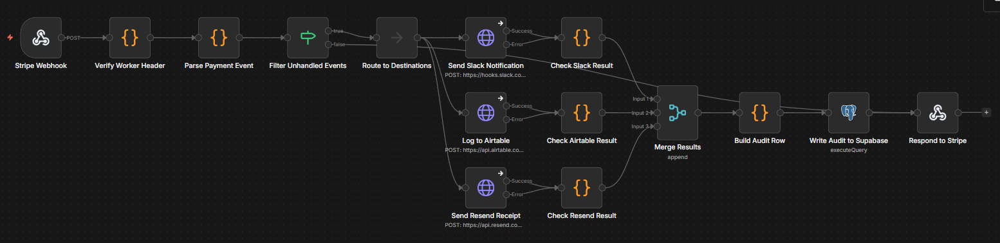
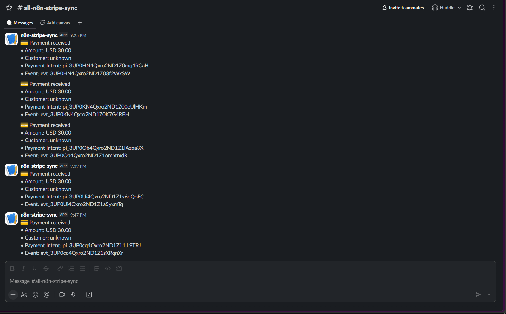
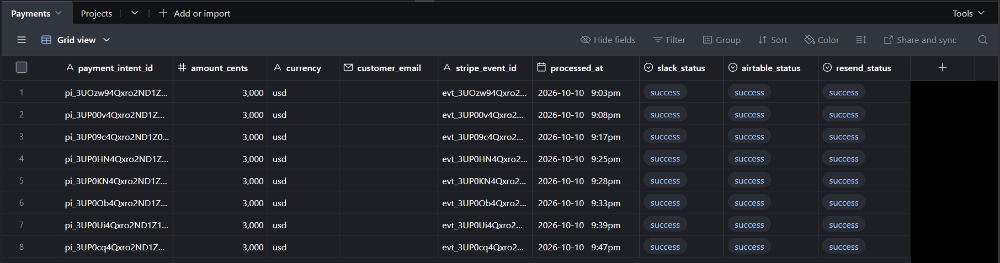
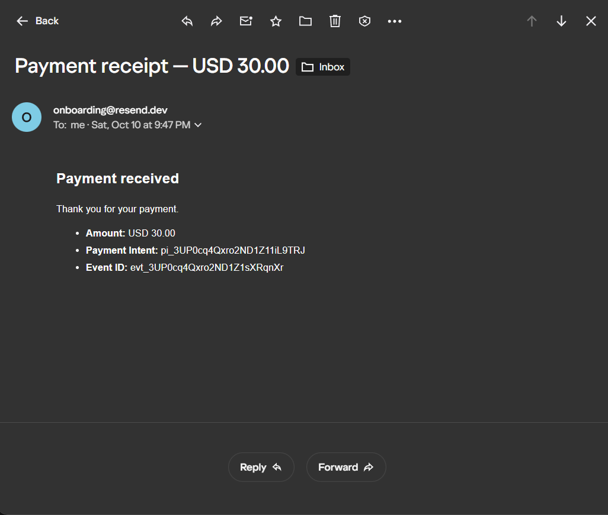
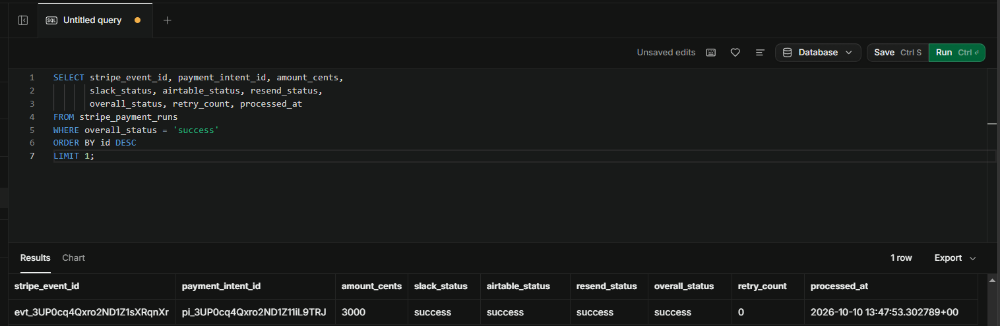
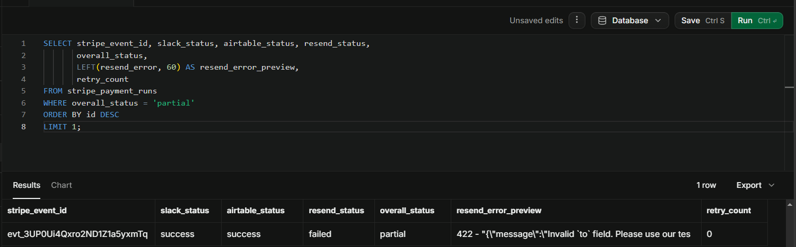
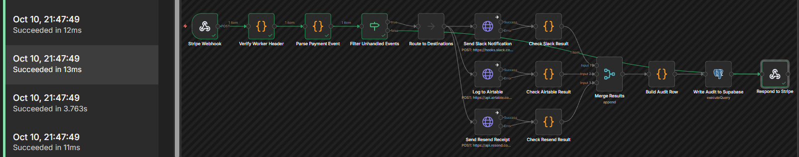
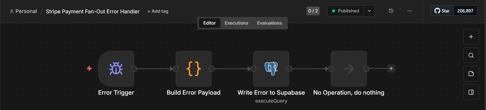
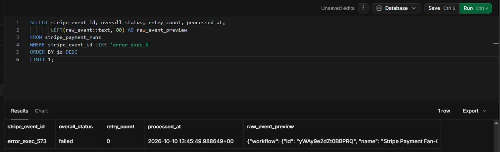

# Workflow 5: Stripe Payment Fan-Out with Partial-Failure Handling

[← Back to README](../../README.md)

**Status:** Verified end to end. Success path, partial-failure path, skip path, and error handler all confirmed.

## Problem

A production payment integration can't treat its downstream destinations as a chain. Stripe fires `payment_intent.succeeded` and `checkout.session.completed` events, and a real workflow needs to do several things at once: notify the team in Slack, write a row to a finance ledger in Airtable, and email the customer a receipt. Each destination has its own failure modes. Slack rate-limits, Airtable has API quotas, Resend enforces recipient rules on the free tier.

If the workflow runs the three destinations in series, a single failure aborts the others. If it runs them in parallel but aborts on any failure, the audit trail loses per-branch detail. Neither is acceptable.

This workflow fans out to three destinations in parallel, tolerates independent failures, and writes one audit row per Stripe event with per-branch status.

## Architecture

```
Stripe Cloud
  │  (HTTPS, signed with Stripe-Signature header)
  ▼
Cloudflare Quick Tunnel (public URL → localhost:3000)
  │  (HTTP)
  ▼
Companion Node.js Process (127.0.0.1:3000)
  │  verifies Stripe signature against the raw body
  │  forwards to n8n with X-Worker-Verified header
  ▼  (HTTP, localhost:5678)
n8n Webhook (/webhook/stripe-payment)
```

```
Stripe Webhook
→ Verify Worker Header
→ Parse Payment Event
→ Filter Unhandled Events
    ├── handled → fan-out (parallel)
    │     ├── Send Slack Notification  → Check Slack Result    ─┐
    │     ├── Log to Airtable          → Check Airtable Result ─┼→ Merge Results (Append, 3 inputs)
    │     └── Send Resend Receipt      → Check Resend Result   ─┘      → Build Audit Row (Code)
    │                                                                   → Write Audit to Supabase (Postgres)
    │                                                                   → Respond to Stripe (200 OK)
    └── skipped → Respond to Stripe (200, skipped: true)
```

Error handling lives in a separate workflow linked via **Settings → Error Workflow**.



## Key implementation details

### Companion Node.js signature verification

n8n 2.8.4's Webhook node does not preserve raw request bodies for `application/json` payloads. The Field Name for Binary Data option only works for non-JSON content types. Stripe's HMAC signature is computed over the exact bytes of the raw body, so re-serializing the parsed JSON produces a different byte sequence and the signature never matches.

The companion process solves this by sitting between Stripe and n8n:

1. Receives the raw HTTP request on `127.0.0.1:3000`.
2. Reads the body as a `Buffer`, not a string.
3. Verifies the `Stripe-Signature` header using `crypto.timingSafeEqual` over the exact Buffer.
4. Enforces a 5-minute replay window on the signature timestamp.
5. Forwards the verified event to n8n on `127.0.0.1:5678` with an `X-Worker-Verified` header containing a shared secret.

The n8n workflow then only needs to verify the shared secret, not the Stripe signature. The companion is a small, auditable process whose only job is validation, a common production pattern when the workflow engine can't access raw request bytes.

### Fan-out with independent failure handling

The three destinations are wired as parallel branches, not as a chain. Each branch runs independently:

- **Send Slack Notification** posts to a Slack incoming webhook.
- **Log to Airtable** creates a row in the `Payments` table.
- **Send Resend Receipt** sends a receipt email via Resend.

Each HTTP node is configured with **On Error: Continue (regular output)**, so an HTTP failure doesn't abort the workflow.

### n8n 2.8.4 On Error behavior and the Check-node workaround

In n8n 2.8.4, an HTTP Request node with *On Error: Continue (using error output)* emits the error item on the main output, not the error output. The error output is effectively dead. The workaround:

1. Use **On Error: Continue (regular output)**.
2. Add a Code node after each HTTP node to inspect the item.
3. Wire both the HTTP node's Success output and Error output to the same Check node.

The Check node reads the item's `error` field (or HTTP status code) and classifies the branch as success or failed, producing a uniform shape:

```json
{
  "branch": "resend",
  "status": "success" | "failed",
  "error": null | "message",
  "response": { "...": "original response" }
}
```

### Merge Results (Append, 3 inputs)

The three Check nodes feed into a Merge node in Append mode with 3 inputs. This waits for all three branches to complete and concatenates their items into a single stream. `Build Audit Row` then reads all three via `$input.all()`.

### Partial-failure audit

`Build Audit Row` indexes the three Check node outputs by branch and computes `overall_status` using this rule:

- All three `success` → `success`
- Zero `success` → `failed`
- Otherwise → `partial`

Then it produces one item with the fields needed for the Supabase insert.

### The `_skip` path

Stripe delivers every event type the account emits, not just the ones the workflow cares about. `Parse Payment Event` returns `{ _skip: true, reason, event_type }` for events that aren't `payment_intent.succeeded` or `checkout.session.completed`.

An IF node (`Filter Unhandled Events`) routes on the `_skip` flag:

- **False branch** → `Respond to Stripe` returns 200 OK with `{ received: true, event_id: "skipped", overall_status: "skipped" }`.
- **True branch** → the full fan-out chain.

Without this filter, skipped events would hang the webhook until Stripe's timeout because `Respond to Stripe` would never be reached.

### Idempotency

The Supabase insert uses `ON CONFLICT (stripe_event_id) DO UPDATE` with an incremented `retry_count`. Stripe retries failed deliveries, and this prevents duplicate rows for the same event.

## Verified behavior

### Success path

Triggered with `stripe trigger checkout.session.completed`. All 14 nodes green. Supabase row:

| Column | Value |
|--------|-------|
| `stripe_event_id` | `evt_3UP09c4Qxro2ND1Z0XMltEpH` |
| `payment_intent_id` | `pi_3UP09c4Qxro2ND1Z09VTPQjR` |
| `amount_cents` | `3000` |
| `slack_status` | `success` |
| `airtable_status` | `success` |
| `resend_status` | `success` |
| `overall_status` | `success` |
| `retry_count` | `0` |

Slack message delivered, Airtable row created, Resend email delivered.









### Partial-failure path

Deliberately broke the Resend `to` field (`wrong@example.com`) and re-triggered. Supabase row:

| Column | Value |
|--------|-------|
| `slack_status` | `success` |
| `airtable_status` | `success` |
| `resend_status` | `failed` |
| `overall_status` | `partial` |
| `resend_error` | `422 - "Invalid 'to' field..."` |

Two branches succeeded, one failed, the workflow completed, Stripe got a 200, and the audit row records which branch failed and why. This is the core portfolio signal for this workflow.



### Skip path

Triggered with a Stripe event type the workflow doesn't handle (`product.created`). The IF node routed it to `Respond to Stripe` on the False branch. The n8n execution completed in under 20ms with `overall_status: "skipped"` in the response body. Stripe received 200. No fan-out ran.



### Error handler

Temporarily added `throw new Error('Test error handler')` to `Parse Payment Event`. The error handler workflow fired and wrote a row:

| Column | Value |
|--------|-------|
| `stripe_event_id` | `error_exec_573` |
| `overall_status` | `failed` |
| `retry_count` | `0` |

The execution ID `573` matches the failed execution in the main workflow.





## Stack

n8n 2.8.4 (self-hosted, Windows) · Stripe test mode (`stripe listen --all-snapshot`) · Slack free tier (incoming webhook) · Airtable free tier (reusing the PAT from [Workflow 4](./04-airtable-notion-two-way-sync.md)) · Resend free tier (recipient restricted to account owner) · Supabase free tier (Postgres 15) · Node.js 18+ (companion process, no dependencies) · Cloudflare Quick Tunnel

## Gotchas

### n8n 2.8.4

- **HTTP Request On Error emits on main output, not error output.** *Continue (using error output)* is broken. Use *Continue (regular output)* and wire both Success and Error outputs to a downstream Check node that classifies the item.
- **`$env` access is blocked in Code nodes.** The companion's shared secret is hardcoded in the `Verify Worker Header` node, not read from `process.env`. The sanitize script strips it before commit.
- **`console.log` in Code nodes writes to the browser console,** not the n8n server terminal. Open Developer Tools (F12) to see debug output.
- **The Webhook node's Respond mode must be *Respond to Webhook Node*** when a Respond node is in the workflow. *Immediately* causes an "Unused Respond to Webhook node found" error at workflow load.
- **Empty Code node output** in "Run Once for All Items" mode can trigger "Code doesn't return items properly." Return `[{ json: { _noop: true } }]` when there are no real items.
- **`NODE_FUNCTION_ALLOW_BUILTIN=crypto`** must be set in the shell that starts n8n. Applies to `require('crypto')` in Code nodes.
- **Postgres `$1` parameters require explicit configuration.** Use `{{ }}` string interpolation for dynamic values.

### Stripe

- **`stripe trigger payment_intent.succeeded` fails with a deprecation error.** Stripe removed `payment_method_types` as a writable parameter. Use `stripe trigger checkout.session.completed` instead. The workflow handles both event types.
- **`stripe listen` requires `--all-snapshot`, `--events`, or `--all-thin`.** Older CLI versions defaulted to forwarding everything; current versions require an explicit scope.
- **The CLI webhook signing secret rotates on every restart.** Update the companion's `STRIPE_WEBHOOK_SECRET` env var and restart after every `stripe listen` restart.
- **Replay window.** Signatures older than 5 minutes are rejected. This prevents replay attacks.

### Slack

- **The incoming webhook URL is a bearer credential.** Anyone with it can post to the channel. Store it in a credential, not in the workflow JSON. The sanitize script strips it before commit.
- **Slack rate-limits on free tier.** If the workflow runs frequently with many events, batch or debounce.

### Airtable

- **Free tier limit: 1,000 API calls/month.** This workflow consumes 1 call per event.
- **Column name and type must match exactly.** `payment_intent_id` (text), `amount_cents` (integer), `currency` (text), `customer_email` (email), `stripe_event_id` (text), `processed_at` (date with time), and three single-select fields for statuses.

### Resend

- **Free tier restricts recipients to the account owner's email.** Sending to any other address returns a 422 or 403. To send to arbitrary recipients, verify a domain in the Resend dashboard.
- **Sender must be `onboarding@resend.dev`** unless a custom domain is verified.
- **Case sensitivity.** The recipient must match the account owner's email exactly, including case.

### Cloudflare

- **`*.workers.dev` subdomains can fail to resolve in public DNS for hours after creation.** The local companion process avoids this entirely by running on `127.0.0.1` and being exposed through a Quick Tunnel.

## Setup prerequisites

1. **Stripe test-mode account** with the CLI installed. Authenticate via `stripe login`.
2. **Slack workspace** with an app configured for incoming webhooks. Copy the webhook URL.
3. **Airtable base** with the `Payments` table. The PAT from Workflow 4 is reused.
4. **Resend account** with an API key. Recipient restricted to the account owner's email.
5. **Supabase project** with the `stripe_payment_runs` table (schema below). Credential `Supabase Postgres v2`.
6. **Node.js 18+** installed. Download the companion script (`scripts/stripe-verify-companion.sample.js`) and copy it to `scripts/stripe-verify-companion.js`.
7. **Environment variables** set in the shell that starts the companion:
   - `STRIPE_WEBHOOK_SECRET`: from `stripe listen` output
   - `N8N_WEBHOOK_URL`: the n8n production webhook URL (e.g., `http://127.0.0.1:5678/webhook/stripe-payment`)
   - `WORKER_SHARED_SECRET`: a random 64-character hex string
   - `LISTEN_PORT`: optional, defaults to `3000`
8. **Cloudflare Quick Tunnel** pointing at port 3000:

   ```
   cloudflared tunnel --url http://127.0.0.1:3000
   ```

9. **Stripe CLI listener** pointing at the tunnel:

   ```
   stripe listen --all-snapshot --forward-to https://<tunnel-url>.trycloudflare.com
   ```

## Supabase schema

```sql
CREATE TABLE IF NOT EXISTS stripe_payment_runs (
    id BIGSERIAL PRIMARY KEY,
    stripe_event_id TEXT NOT NULL,
    payment_intent_id TEXT,
    amount_cents INTEGER,
    currency TEXT,
    customer_email TEXT,
    slack_status TEXT NOT NULL DEFAULT 'skipped'
        CHECK (slack_status IN ('success', 'failed', 'skipped')),
    airtable_status TEXT NOT NULL DEFAULT 'skipped'
        CHECK (airtable_status IN ('success', 'failed', 'skipped')),
    resend_status TEXT NOT NULL DEFAULT 'skipped'
        CHECK (resend_status IN ('success', 'failed', 'skipped')),
    slack_error TEXT,
    airtable_error TEXT,
    resend_error TEXT,
    overall_status TEXT NOT NULL DEFAULT 'failed'
        CHECK (overall_status IN ('success', 'partial', 'failed')),
    retry_count INTEGER NOT NULL DEFAULT 0,
    processed_at TIMESTAMPTZ NOT NULL DEFAULT NOW(),
    raw_event JSONB
);

CREATE UNIQUE INDEX IF NOT EXISTS idx_stripe_payment_runs_event_id
    ON stripe_payment_runs (stripe_event_id);

CREATE INDEX IF NOT EXISTS idx_stripe_payment_runs_processed
    ON stripe_payment_runs (processed_at DESC);
```

## Companion script role

The companion script (`scripts/stripe-verify-companion.js`) is the only process that sees the raw Stripe request body. It exists because n8n 2.8.4 cannot preserve raw bodies for JSON payloads, which breaks signature verification.

The companion's entire responsibility: verify signatures, forward verified events. It does not parse events, does not look at field values, and does not make business decisions. That makes it small enough to audit in five minutes.

The sanitized sample file (`scripts/stripe-verify-companion.sample.js`) documents the pattern for reviewers. The working version is excluded from the repo via `.gitignore` because it references the live shared secret in the environment.

## Testing checklist

1. Confirm the Stripe CLI is authenticated (`stripe login`).
2. Start the companion with the three required env vars set.
3. Start the Cloudflare tunnel pointing at `127.0.0.1:3000`.
4. Start `stripe listen --all-snapshot` pointing at the tunnel URL.
5. Copy the `whsec_...` from the CLI output into the companion's env var. Restart the companion.
6. Trigger a success case: `stripe trigger checkout.session.completed`.
7. Verify: Slack message appears, Airtable row created, Resend email delivered, Supabase row shows `overall_status = 'success'`.
8. Break the Resend `to` field. Trigger again.
9. Verify: Slack and Airtable succeed, Resend fails, Supabase row shows `overall_status = 'partial'` with `resend_error` populated.
10. Restore the Resend `to` field.
11. Trigger a `product.created` event. Verify 200 response with `overall_status: "skipped"` and no fan-out.
12. Break `Parse Payment Event` with a `throw`. Trigger. Verify the error handler writes an `error_exec_*` row to Supabase.

## Roadmap

- **Selective retry on duplicate events.** Currently, when Stripe retries a failed delivery, all three branches re-run. A production version would read the existing audit row and only re-attempt branches where `*_status = 'failed'`.
- **Companion process hardening.** Add structured logging, metrics, rate limiting on the HTTP server, and graceful shutdown.
- **Persistent tunnel.** Cloudflare Quick Tunnel URLs rotate on restart. A named tunnel with a custom domain would stabilize the URL.
- **Slack message formatting.** Currently plain text. Block Kit formatting with rich fields and buttons would be a nicer presentation.
- **Airtable status updates on retry.** Currently the Airtable row is created with success status fields hardcoded. On retry, the row should be updated, not duplicated.
- **Stripe live-mode webhook.** Currently test mode only. Live mode requires a real endpoint with a stable DNS name and a real signing secret.

## Monitored by

**Stripe Payment Fan-Out Error Handler**, a separate workflow linked via **Settings → Error Workflow**. Fires on automatic execution failures. Writes an `error_exec_*` row to `stripe_payment_runs` with `overall_status = 'failed'` and the error payload in `raw_event`.

Manual executions do not fire the Error Trigger.